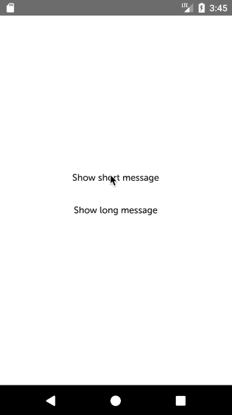

# react-native-messages

React Native notification-like messages



## Features
- Customizable message component
- Fast native driver animations
- Auto-hide current message to display a next one
- Robust implementation, used in production code

## Installation
```
$ npm install react-native-messages
```

## Usage
1. Add `<MessageBar/>` to the top of your view hierarchy, as a last component. If you are using `react-navigation`, root navigator should be in place of `<App/>`. Root view should have `flex: 1`:
```jsx
import { MessageBar } from 'react-native-messages';

<View style={{ flex: 1 }}>
  <App/>
  <MessageBar/>
<View>
```

2. Call `showMessage` in any other component:
```jsx
import { showMessage } from 'react-native-messages';

<Button onPress={() => showMessage('You are awesome!')}/>
```

## Config
Prop                  | Type      | Default              
----------------------|-----------|--------------------------
messageComponent      | Component | Default message component
duration              | Number    | 1000
slideAnimationOffset  | Number    | 40
showAnimationDuration | Number    | 255
hideAnimationDuration | Number    | 255
closeOnSwipe          | Boolean   | true

You can add custom config as a second argument to `showMessage` call to configure individual messages. E.g. `showMessage('You are awesome!', { duration: 3000 })`.

## Custom message component
Default message will receive only string, but you can implement your own message component to work with any other objects e.g Error instances. Your message component will also be passed a `hideMessage` prop. Simply call `hideMessage()` to hide the notification.

```jsx
function Message({ message, hideMessage }) {
  if (message instanceof Error) {
    // return error-styled message
  } else {
    // return normal message
  }
}

<MessageBar messageComponent={Message}/>

<Button onPress={() => showMessage(new Error('Boom!'))}/>
```


## Demo

```
$ git clone git@github.com:Qlean/react-native-messages.git
$ cd react-native-messages/demo
$ npm install
$ npm start
$ react-native run-android # assuming Android emulator is running: https://facebook.github.io/react-native/docs/getting-started.html#installing-dependencies
```

## Contributing

Same as demo. Run `npm install` in root directory to install ESLint.
